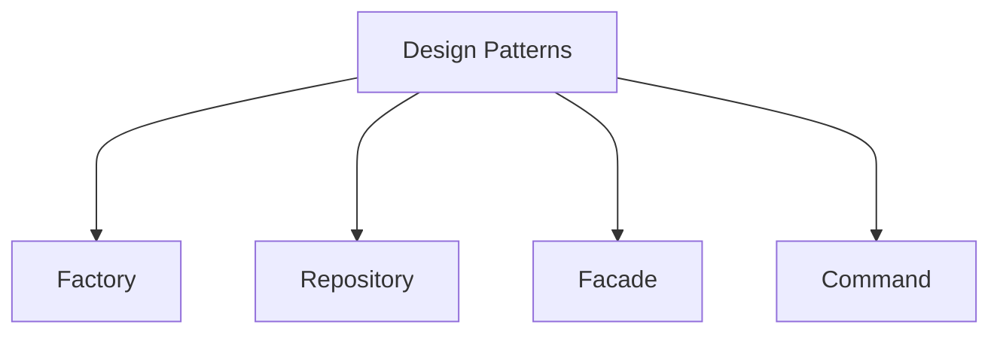

### Design Patterns in Software Architecture World

#### The Factory Pattern

- Creating objects without specifying the exact class of the object.
- Avoid strong coupling between classes ( Factory pattern avoid strong coupling)

#### The Repository Pattern

- Modules not handling the actual work with the datastore should be oblivious to the data store type.

#### The Facade Pattern

- Creating a layer of abstraction to mask complex actions.

