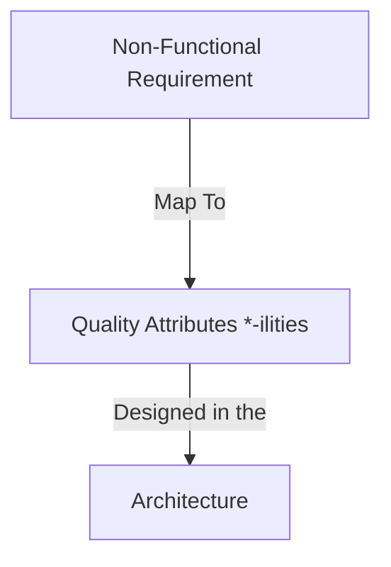

## Introduction to *ilities

### Important Types of *ilities
1. Scalability
2. Manageability
3. Modularity
4. Extensibility
5. Testability

#### Scalability
- Adding computing resources without any interruption.
- Scalability Types
  - `Scale Up` - Adding CPU power and Memory to existing Server (Up Means More Power)
  - `Scale Out` - Adding more Server (Out Means More In)
  - Prefer `Scale Out` instead of Scale Up.

#### Manageable
- Simply means what and how our application is performing.
- Simple word - monitor the application.

#### Modularity
- A system that is build using the building blocks and those **blocks can be changed or removed easily**.
- We can use the `encapsulation/isolation` for each component or mechanism.

#### Extensibility
- A system that its functionality can be extended without modifying its existing code.
- We can use `inheritance or plugin framework` (dependency injection).
