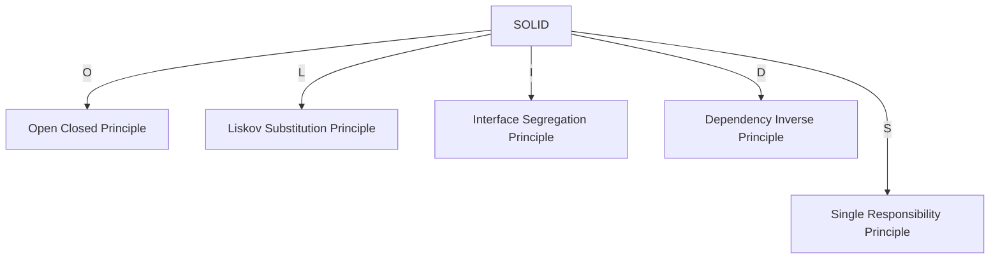

## SOLID

### Solid Terminology
- This was first coined by Bob Martin in 2000.

### Stands For

#### Single Responsibility Principle 
- Each class should have single functionality
- Single method should do only one thing.

#### Open Closed Principle
- A software should be open for extension but closed for modification.
- Means a software should not modify its code but to extend functionality without touching existing code.
- Use **inheritance** for this 
- Use **Plug In** for this

#### Liskov Substitution Principle
- Basically telling about polymorphism.
- No new functionality needs be added (mechanism) when addition is done.

#### Interface Segregation Principle
- Many client specific interfaces are better than one general purpose interface.

#### Dependency Inverse Principle
- Dependency Injection