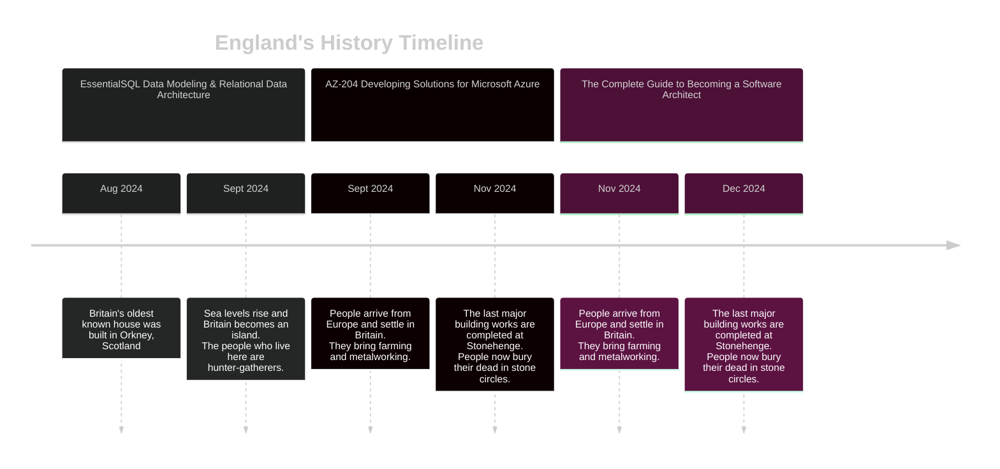

# swotting-architecture

### TimeLines for Courses

# TODO : Fix This

```mermaid
%%{init: { 'logLevel': 'debug', 'theme': 'dark' } }%%
timeline
    title England's History Timeline
        section  EssentialSQL Data Modeling & Relational Data Architecture
          Aug 2024 : Britain's oldest known house was built in Orkney, Scotland
          Sept 2024 : Sea levels rise and Britain becomes an island.<br> The people who live here are hunter-gatherers.
        section AZ-204 Developing Solutions for Microsoft Azure
          Sept 2024 : People arrive from Europe and settle in Britain. <br>They bring farming and metalworking.
          Nov 2024 : The last major building works are completed at Stonehenge.<br> People now bury their dead in stone circles.
        section The Complete Guide to Becoming a Software Architect
          Nov 2024 : People arrive from Europe and settle in Britain. <br>They bring farming and metalworking.
          Dec 2024 : The last major building works are completed at Stonehenge.<br> People now bury their dead in stone circles.
```